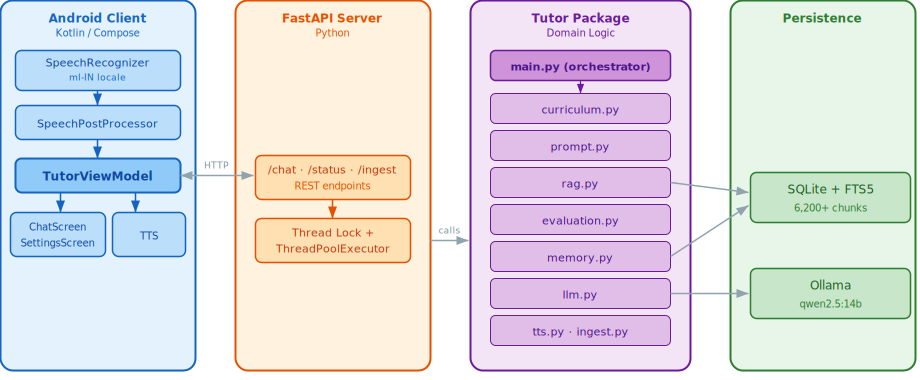
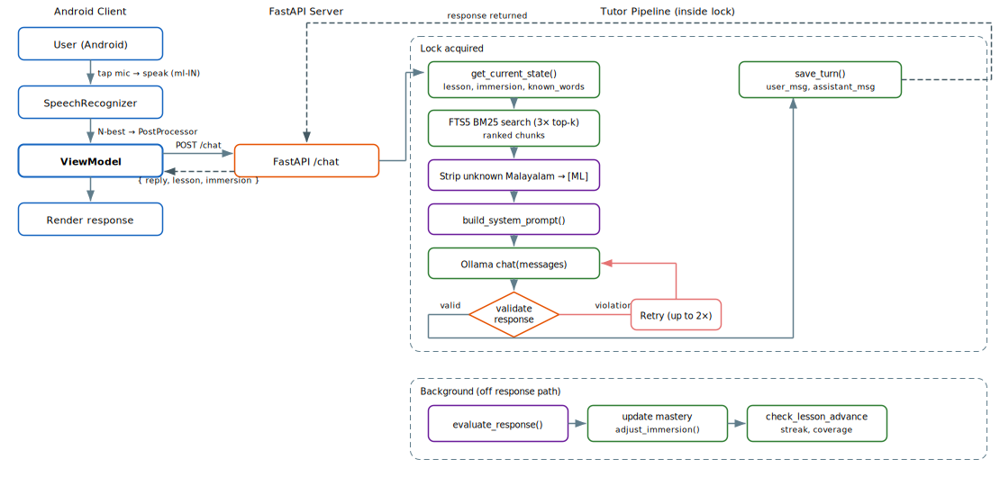

# Language AI Tutor — Showcase

> **Note:** This repository is a sanitized architectural showcase. Full implementation is private.

---

## Overview

An adaptive language tutor that teaches through code-switched conversation — target-language words are introduced one at a time based on the learner's mastery, embedded naturally in English sentences. The system combines retrieval-augmented generation over 6,200+ content chunks with a novel word-level substitution prompt that prevents the LLM from producing full target-language sentences, enforced by regex-based validation with automatic retry.

---

## Architecture



### Layers

| Layer | Responsibility | Key Components |
|-------|---------------|----------------|
| Presentation | Android UI, speech input, state observation | Jetpack Compose, MVVM, SpeechRecognizer (ml-IN) |
| API | Request orchestration, thread-safe pipeline | FastAPI, ThreadPoolExecutor |
| Domain | Curriculum, evaluation, prompt assembly, retrieval | 11 single-responsibility Python modules |
| Persistence | Content indexing, user state, conversation history | SQLite FTS5 |

### Data Flow



---

## Key Modules

### `prompt.py`

**Purpose:** Assembles the system prompt with word-level substitution gating — the known-word list determines exactly which target-language tokens the LLM may use.

**Interface:**

```python
def build_system_prompt(
    *,
    current_lesson: int,
    language_percent: int,
    weak_topics: list[str],
    known_words: list[str],
    rag_context: str,
    review_words: list[str] | None = None,
    unintroduced_words: list[str] | None = None,
) -> str:
    """Assemble the system prompt for the LLM.

    The prompt contains a CRITICAL RULE: target-language script ONLY for words
    in the known list + at most 2 new words with (English translation).
    """
    ...
```

### `evaluation.py`

**Purpose:** Validates tutor responses against code-switching rules using pure regex — no LLM sub-call. Detects wrong scripts, romanised target-language input, bare tokens, and excess introductions.

**Interface:**

```python
def validate_tutor_response(
    response: str,
    known_words: list[str],
    max_new_words: int = MAX_NEW_WORDS_PER_TURN,
) -> dict[str, Any]:
    """Check whether a tutor response follows code-switching rules.

    Returns:
        Dict with 'valid' (bool), 'violations' (list[str]),
        'bare_tokens', 'introduced_tokens', etc.
    """
    ...

def evaluate_response(
    conn: sqlite3.Connection,
    *,
    user_input: str,
    target_words: list[str],
    target_concepts: list[str],
) -> dict[str, Any]:
    """Evaluate user input and update mastery scores.

    Uses regex-based word matching — no LLM call.
    """
    ...
```

### `rag.py`

**Purpose:** FTS5 retrieval with BM25 ranking, source-type weighting, and unknown-language stripping to prevent the LLM from copying unlearned words from context.

**Interface:**

```python
def retrieve(
    conn: sqlite3.Connection,
    query: str,
    top_k: int = RAG_TOP_K,
    current_lesson: str | None = None,
) -> list[dict[str, Any]]:
    """Retrieve top-k content chunks matching query.

    Uses FTS5 BM25 with source-type boosting and current-lesson priority.
    """
    ...

def format_context(
    chunks: list[dict[str, Any]],
    known_words: list[str] | None = None,
) -> str:
    """Format chunks for prompt, stripping unknown target-language tokens."""
    ...
```

### `curriculum.py`

**Purpose:** Adaptive lesson progression — tracks mastery, adjusts immersion percentage, determines when to advance lessons based on confidence, streak, and vocabulary coverage.

**Interface:**

```python
def get_current_state(conn: sqlite3.Connection) -> dict[str, Any]:
    """Return full learner state: lesson, immersion, known words,
    weak topics, review words, unintroduced words."""
    ...

def adjust_immersion(conn: sqlite3.Connection, *, correct: bool) -> int:
    """Adjust immersion percentage: +2% on correct, -5% on incorrect."""
    ...

def check_lesson_advance(conn: sqlite3.Connection, *, streak: int) -> bool:
    """Advance lesson if: confidence >= 0.75, streak >= 3,
    vocab coverage >= 70%, all words introduced."""
    ...
```

---

## Engineering Decisions

| Decision | Choice | Rationale | Tradeoff |
|----------|--------|-----------|----------|
| LLM output control | Word-level substitution gating | Percentage-based instructions ("speak 30% [target language]") produced unpredictable output; explicit known-word list gives deterministic control | Prompt grows with vocabulary (capped at 50 words); requires validation + retry |
| Content search | FTS5 with BM25 over vector embeddings | Structured content (lesson tables, grammar charts) benefits from exact keyword matching; no embedding model dependency | Misses semantic similarity; mitigated by combining lesson title with query |
| Response validation | Pure regex over LLM judge | Instant and deterministic vs. 2-6s latency per LLM sub-call; primary failure mode is structural (wrong script, missing translation) not semantic | Cannot catch grammatically incorrect target-language output |
| RAG context safety | Strip unknown target-language tokens | LLM copies target-language tokens from reference material, bypassing vocabulary gating; replacing with [TL] prevents this | Loses some context richness; English portions sufficient for relevance |
| Evaluation timing | Background ThreadPoolExecutor | Mastery updates don't affect current response; running synchronously adds perceptible latency | `advanced` flag lags by one turn |
| Speech input | System STT (ml-IN) over on-device Whisper | Built and tested full whisper.cpp JNI integration; tiny model couldn't handle the target language, base model marginal; Google ml-IN handles code-switching natively | Requires network; acceptable for server-based phase |

---

## Example Code

### Word-Level Substitution Prompt (Core Innovation)

```python
_SYSTEM_TEMPLATE = """\
You are a conversational language tutor.

CRITICAL RULE — word-level substitution:
1. Target-language script ONLY for:
   a) Words in the KNOWN list below, AND
   b) At most 2 NEW words — each MUST be followed by (English translation)
2. Every other word MUST be in English.
3. Do NOT write full target-language sentences.
4. Do NOT use romanised target-language input.

KNOWN target-language words (may appear freely without translation):
{known_words_list}

UNINTRODUCED words (pick new words from this list):
{unintroduced_section}
"""
```

**Why this matters:** This is the core innovation — instead of asking the LLM to "speak X% [target language]" (which produces unpredictable output), we give it an explicit word whitelist. Combined with regex validation and retry, this achieves reliable word-level code-switching.

### Unknown-Language Stripping in RAG Context

```python
def _strip_unknown_malayalam(text: str, known_words: set[str]) -> str:
    """Replace target-language tokens not in known_words with '[TL]' placeholder."""
    def _replace(match: re.Match[str]) -> str:
        token = match.group(0)
        return token if token in known_words else "[ML]"
    return _ML_CHAR_RE.sub(_replace, text)
```

**Why this matters:** Without this, the LLM copies target-language tokens from RAG chunks into its response — bypassing the vocabulary gating rule entirely. This was a persistent failure mode that required a data-level fix, not just prompt tuning.

### Bilingual Speech Post-Processing

```kotlin
class SpeechPostProcessor(private val knownWords: Set<String>) {
    fun pickBest(alternatives: List<String>): String {
        return alternatives.maxByOrNull { alt ->
            alt.split("\\s+".toRegex())
                .count { token -> token in knownWords }
        } ?: alternatives.first()
    }
}
```

**Why this matters:** Android's SpeechRecognizer returns N-best alternatives. Scoring each against the user's known vocabulary selects the most contextually accurate transcription for bilingual input.

---

## Project Structure

```
malayalam/
├── tutor/                  ← Python package (domain logic)
│   ├── config.py           ← Constants, paths, parameters
│   ├── db.py               ← SQLite schema, migrations, helpers
│   ├── ingest.py           ← Content indexer (730+ files → 6,200+ chunks)
│   ├── rag.py              ← FTS5 retrieval + unknown-word stripping
│   ├── memory.py           ← User profile + conversation window
│   ├── curriculum.py       ← Lesson progression + immersion control
│   ├── prompt.py           ← Word-level substitution prompt assembly
│   ├── evaluation.py       ← Response validation + mastery scoring
│   ├── llm.py              ← Ollama HTTP wrapper
│   └── tts.py              ← Dual-engine TTS (target language + English)
├── server/                 ← FastAPI REST API
│   ├── app.py              ← Endpoints + chat pipeline orchestration
│   └── models.py           ← Pydantic request/response schemas
├── android/                ← Kotlin/Compose Android client
│   └── app/src/main/
│       ├── ui/             ← ChatScreen, SettingsScreen
│       ├── viewmodel/      ← TutorViewModel (MVVM)
│       ├── speech/         ← SpeechInput, SpeechPostProcessor
│       └── data/           ← SettingsRepository, TutorRepository
├── content/                ← Read-only knowledge base
│   ├── lessons/            ← 166 lesson files
│   ├── grammar/            ← 28 grammar modules
│   ├── textbook/           ← 557 OCR pages
│   └── worksheets/         ← 6 worksheet extracts
├── tests/                  ← pytest test suite
└── docs/                   ← Design documents
```

---

## Tech Stack

| Layer | Technology |
|-------|-----------|
| Language (Android) | Kotlin 2.1.0 |
| Language (Backend) | Python 3.12 |
| UI | Jetpack Compose + Material3 |
| Architecture | MVVM (Android), Layered (Backend) |
| API | FastAPI |
| Database | SQLite + FTS5 |
| LLM | Ollama (qwen2.5:14b) |
| TTS | gTTS + Coqui TTS (dual-engine) |
| Speech Input | Android SpeechRecognizer |
| Build | Gradle (AGP 8.7.0), pip + venv |
| Testing | pytest, JUnit |

---

## Code Availability

This repository contains a sanitized subset of the system, focusing on architecture, modular design, and engineering decisions. Core business logic and proprietary data are maintained in a private repository.
